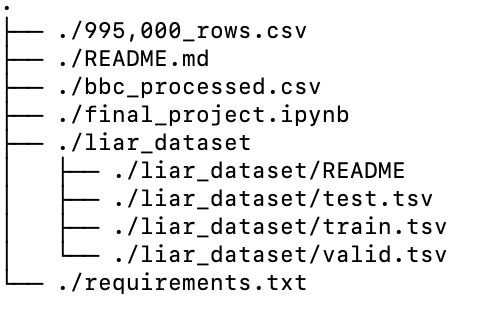
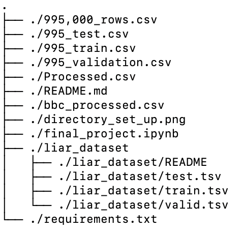

# Final Project README file

If you are in the GitHub Repository, all of our final project can be found in the folder tiled 'Final_Project'

## Recreating our code directory

To begin, all of our code can be found in the file labeled 'final_project.ipynb'. Each chunk of code is labeled with the corresponding task. For example, the 'Preprocessing' section can be found under the 'Prcess Data' label.

As well, our project files can all be gotten by pulling from our GitHub Repository, located at the following link: https://github.com/simonstendal/gds_final_project/tree/master. In order to properly render the photos below, see the README file located in the 'Final_Project' directory in GitHub.

The first chunk of code in our Jupyter Notebook will download all dependencies required to run the rest of our code. However, we also provide a 'requirements.txt' file, in the case you would like to create a separete environment to run our project in. 

Our code assumes you have two files and one directory in addition to this README.md file and the Jupyter Notebook. For one, you should have the '995,000_rows.csv' file in the same directory as the Jupyter Notebook. As well, if you want to test our Logistic Regression model with the BBC Data from assignment 2 of this course, we have submitted the already pre-processed BBC data as 'bbc_processed.csv'. Lastly, the LIAR Dataset directory should be saved in your directory as 'liar_dataset'. Your directory should look like the following before you can run our code:

## Post processing and splitting data

At this point, you should be able to process the data and split the data. Processing the data can take upwards of two hours to complete. After all is done, your repository should look something like this:

Do note, in order to run our notebook correctly, each block must be run one after another.

## Running our models

Now you should be able to run our models. You should get printed statements displaying the results, as well as the steps each model has completed as it completes them. 
